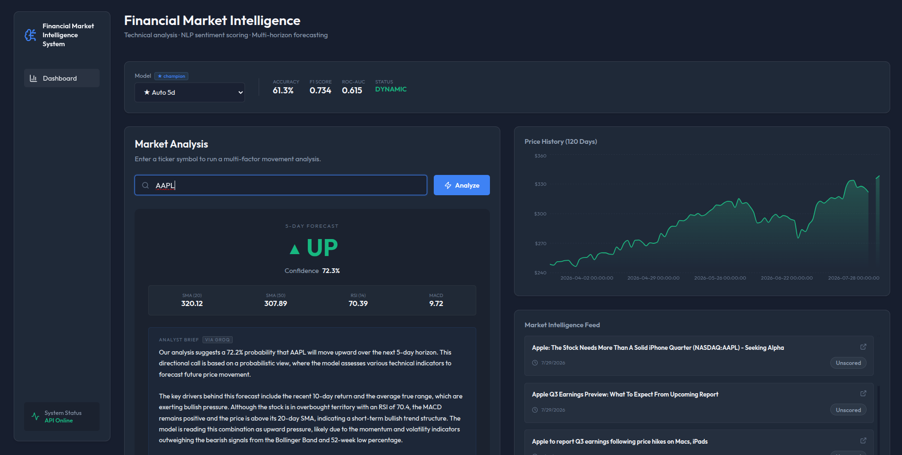
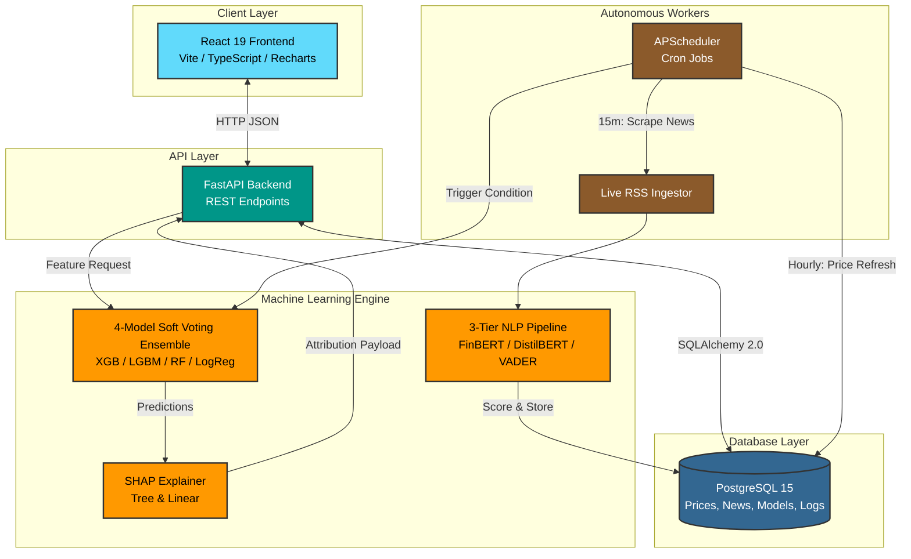

<div align="center">
  <h1>Financial Market Intelligence System</h1>
  <p><strong>Enterprise-grade AI/ML platform for multi-horizon stock prediction and real-time news sentiment analysis.</strong></p>

  [](https://www.python.org/)
  [](https://reactjs.org/)
  [](https://fastapi.tiangolo.com/)
  [](https://opensource.org/licenses/MIT)
</div>

<br/>

The **Financial Market Intelligence System** synthesizes quantitative technical indicators with Natural Language Processing (NLP) to forecast 1-day, 3-day, and 5-day stock movements. Unlike black-box models, this platform prioritizes **Explainable AI (XAI)** using SHAP to provide transparent, real-time feature attribution for every prediction.

Built with an autonomous background scheduler, it continuously ingests live RSS news, scores articles via financial transformers (FinBERT/VADER), updates OHLCV prices, and self-maintains through automated model retraining.

---

## Dashboard Preview


<div align="center">
  
  <p><i>Live prediction dashboard featuring dynamic  Recharts visualizations.</i></p>
</div>

---

## Key Features

- **Multi-Horizon Forecasting**: Predict 1-day, 3-day, and 5-day market trends using an optimized machine learning pipeline.
- **Multi-Model Inference**: Employs an accuracy-weighted soft-voting ensemble comprising **XGBoost, LightGBM, Random Forest,** and **Logistic Regression**.
- **Explainable AI (XAI)**: Generates dynamic **SHAP** (SHapley Additive exPlanations) impact charts per prediction, explaining exactly *why* a decision was made.
- **3-Tier NLP Pipeline**: Real-time news sentiment scoring via RSS, falling back gracefully from **FinBERT** to **DistilBERT** to **VADER** depending on compute constraints.
- **Autonomous Operations**: Embedded `APScheduler` fetches prices/news hourly, triggers automated re-training when enough new data accumulates, and runs a daily 02:00 UTC DB/disk pruning cycle.
- **Zero Data Leakage**: Enforces strict per-symbol grouping during feature engineering and utilizes `TimeSeriesSplit` cross-validation to prevent temporal look-ahead bias.

---

## System Architecture



---

## Technology Stack

| Category | Technologies |
|---|---|
| **Frontend** | React 19, TypeScript, Vite, Recharts, Vanilla CSS (Glassmorphism) |
| **Backend** | Python 3.10+, FastAPI, SQLAlchemy 2.0, Alembic, Pydantic v2 |
| **Machine Learning** | XGBoost, LightGBM, Scikit-Learn, SHAP, Optuna |
| **NLP** | Transformers (HuggingFace FinBERT/DistilBERT), NLTK (VADER) |
| **Infrastructure** | Docker Compose, PostgreSQL 15, `uv` (Fast Python Package Manager), Nginx |

---

## Quick Start (Docker)

The fastest way to run the entire stack locally is using Docker Compose.

```bash
# 1. Clone the repository
git clone https://github.com/parthivkola/financial-market-intelligence-system.git
cd financial-market-intelligence-system

# 2. Setup environment variables
cp .env.example .env
# Open .env and add your ALPHAVANTAGE_API_KEY and HUGGINGFACE_TOKEN

# 3. Build and launch the containers
docker compose up --build -d
```

**Services will be available at:**
- **Frontend App:** [http://localhost:5173](http://localhost:5173)
- **Backend API:** [http://localhost:8080](http://localhost:8080)
- **Interactive API Docs (Swagger):** [http://localhost:8080/docs](http://localhost:8080/docs)

---

## Deployment Instructions (AWS / Cloud)

This application is designed to be highly resilient on cloud infrastructure (e.g., AWS EC2 `t3.micro`/`t3.small`). 

1. **Provision a Server**: Ubuntu 22.04 LTS is recommended. Install `docker` and `docker-compose`.
2. **Clone & Configure**: Clone the repo and setup your `.env` file.
3. **Run**: 
   ```bash
   docker compose up -d --build
   ```
4. **Nginx Dynamic DNS**: The provided `nginx.conf` utilizes Docker's internal DNS (`127.0.0.11`) to prevent 502 Bad Gateway errors if the backend container dynamically restarts (e.g., during intense ML training memory spikes).
5. **Memory Optimization**: The system enforces **Sequential ML Training** and aggressive garbage collection (`gc.collect()`) between trials to ensure it never triggers a Linux OOM killer, even on 1GB RAM instances.

---

## Core API Endpoints

The FastAPI backend automatically generates interactive Swagger documentation. Here are the core routes:

| Method | Endpoint | Description |
|---|---|---|
| `GET` | `/api/v1/health` | System health check and available models |
| `GET` | `/api/v1/models` | Lists all trained models with cross-validated metrics |
| `GET` | `/api/v1/history/{symbol}`| Returns up to 90 days of historical OHLCV prices |
| `GET` | `/api/v1/news/{symbol}` | Returns recent news articles scored for sentiment |
| `POST` | `/api/v1/predict` | Executes ML inference and returns prediction + SHAP values |

---

## Disclaimer

**For research and educational purposes only. Not financial advice.** 
The predictions generated by this software should not be used to make actual investment decisions.

---

<div align="center">
  <p>Built by Parthiv Kola</p>
</div>
